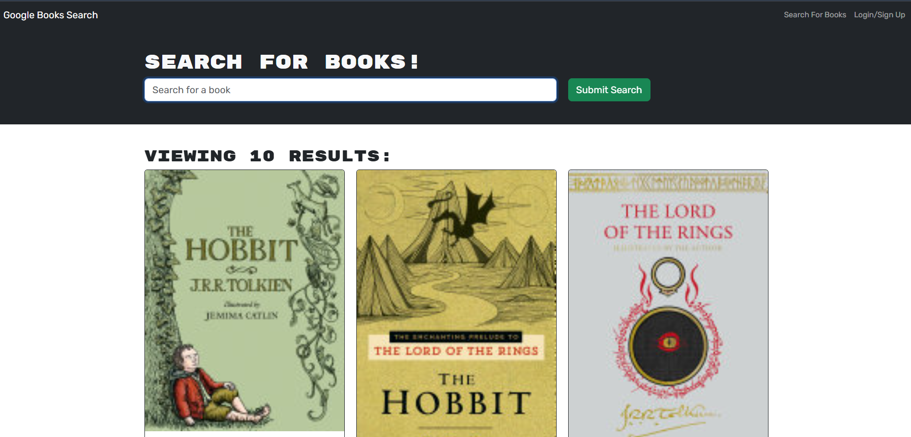

# 📚 MERN Book Search Engine

> A GraphQL‑powered Google Books search & personal library app built on the MERN stack.  
> Search for books, sign up/log in, save favorites, and manage your reading list—all deployed on Render with MongoDB Atlas.

---

## 🔗 Live Demo & Repo

- **Live Demo:** https://your-render-url.onrender.com  
- **GitHub Repository:** https://github.com/PHTMGatt/18-MERN-Book-Search-Engine

---

## 🛠 Tech Stack

<table>
  <tr>
    <td>

| Layer      | Technology                        |
| ---------- | --------------------------------- |
| Front‑end  | React, Apollo Client, TypeScript  |
| Back‑end   | Node.js, Express.js, Apollo Server|
| Database   | MongoDB Atlas, Mongoose           |
| Auth       | JWT, Context Middleware           |
| Deployment | Render                            |

    </td>
    <td>

    </td>
  </tr>
</table>

---

## ✨ Features

- **Book Search** — query the Google Books API for titles, authors, descriptions, covers & links  
- **User Auth** — signup/login with JWT stored in HTTP headers via Apollo Context  
- **Save & Remove** — persist your favorites in a MongoDB collection  
- **GraphQL API** — built with Apollo Server on Express  
- **Apollo Client** — attaches token via `authLink` middleware  
- **Responsive UI** — modern React interface with modal forms  
- **Deployed** — live on Render backed by MongoDB Atlas  

---

## 🔙 Back‑End Overview

- **server.ts**  
  - Initializes `ApolloServer({ typeDefs, resolvers })`  
  - Applies `express.urlencoded()` & `express.json()`  
  - Serves React build in production  
  - Mounts `/graphql` endpoint with `authenticateToken` context  

- **auth.ts**  
  - Extracts the `Authorization` header  
  - Verifies JWT; attaches decoded `user` payload to GraphQL context  

- **Schemas/**  
  - **typeDefs.ts** — GraphQL schema: `Book`, `User`, `Auth`, input `BookInput`, `getMe` query, `addUser/login/saveBook/deleteBook` mutations  
  - **resolvers.ts** — resolver functions for user auth, `$addToSet`, `$pull`, and data fetching  

---

## 🖥 Front‑End Overview

- **App.tsx**  
  - Wraps the app in `<ApolloProvider>` with `InMemoryCache` & `authLink`  
  - Configures React Router for navigation  

- **queries.ts** / **mutations.ts**  
  - GraphQL operations: `GET_ME`, `LOGIN_USER`, `ADD_USER`, `SAVE_BOOK`, `REMOVE_BOOK`  

- **SearchBooks.tsx**  
  - Form for querying Google Books API  
  - Uses `useMutation(SAVE_BOOK)` to save selected books  

- **SavedBooks.tsx**  
  - Uses `useQuery(GET_ME)` to load saved books  
  - Uses `useMutation(REMOVE_BOOK)` to remove saved books  

- **SignupForm.tsx** / **LoginForm.tsx**  
  - Modal components wired to `ADD_USER` & `LOGIN_USER` mutations  

---

## 📄 License

© 2024 edX Boot Camps LLC. Confidential & Proprietary. All Rights Reserved.
